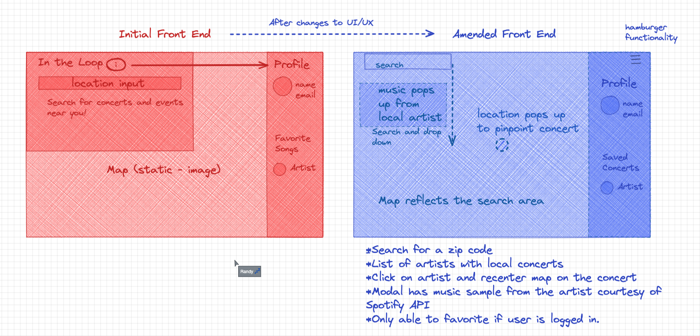

# 'N The Loop

    

<h1 align ="center">'N The Loop</h1>

A project to find live music nearby &amp; choose shows by ear.

<h2 align="center">Table of Contents</h2>

* [FolderStructure]()
* [Wireframe]()
* [Database Structure and Overview]()
* [Collaboration Approach: Scrum]()
* [Contributors]()
* [License]()

<h2 href="#Wireframe" >Wireframe</h2>

 

 <h2 href="#Scrum" >Collaboration Approach: Scrum</h2>

 

<h2 href="#Contributors" >Contributors</h2>

<table align="center">
  <tr>
    <td valign="top"> </td>
    <td valign="top"> </td>
    <td valign="top"> </td>
    <td valign="top"> </td>
    <td valign="top"> </td>
  </tr>
  <tr>
      <td valign="top"><h2 align="center">Eric Saldivar</h2></td>
      <td valign="top"><h2 align="center">Sergey Zeygerman</h2></td>
      <td valign="top"><h2 align="center">Cameron Walls</h2></td>
      <td valign="top"><h2 align="center">Adam Blackwell</h2></td>
      <td valign="top"><h2 align="center">Randy Diebold </h2></td>
  </tr>
   <tr>
      <td align="center"></td>
      <td align="center"></td>
      <td align="center"></td>
      <td align="center"></td>
       <td align="center"></td>
  </tr>
</table>
<h2 href="#License" >License</h2>

This product is licensed under the MIT License.

<h3 align="left">Languages and Tools:</h3>

 
    </a>  
  

